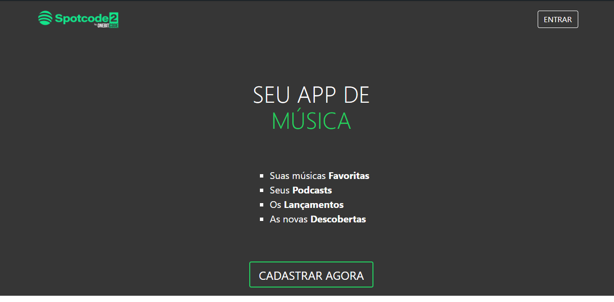

# << SPOTCODE >>

Um repositório para o projeto da semana da onebitcode, utilizando React e Ruby.

Abaixo contém informações sobre como baixar e rodar esta aplicação

Coisas que você deve saber sobre este PWA:

* Ruby version - 2.5.1

* System dependencies - Subsistema Ubuntu no Windows

* Configuration - tudo ja está previamente configurado

* Database creation - db:migrate

* Database initialization

* How to run the test suite

* Services (job queues, cache servers, search engines, etc.)

* Deployment instructions

## Comandos para baixar esta aplicação

**git-clone add {link_repository}

**yarn start

Para rodar o servidor, basta digitar no console, rails s

